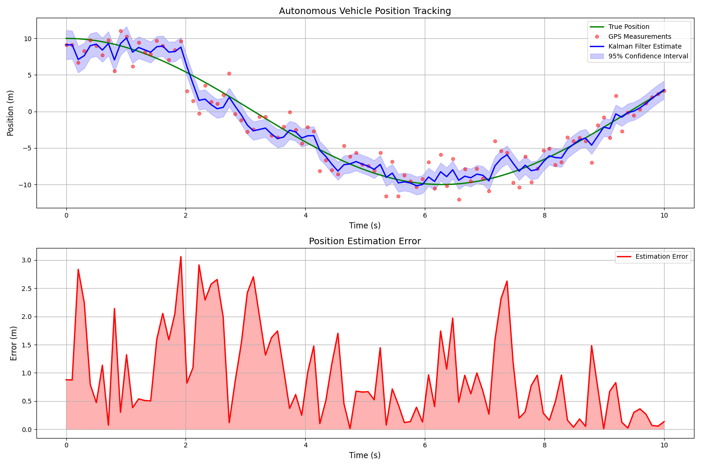

# 🚗 Kalman Filters for Autonomous Vehicles

[]()
[]()
[]()

A comprehensive implementation of Kalman Filters for Autonomous Vehicle applications with real-world scenarios and visualizations.

## 🎯 Key Features

- **State-of-the-art Implementation**: Robust Kalman Filter designed specifically for autonomous vehicle tracking
- **Real-world Scenarios**: Simulated autonomous driving scenarios including turns, lane changes, and intersections
- **Interactive Visualizations**: Rich visual outputs showing vehicle trajectories, uncertainty estimates, and error analysis
- **Performance Metrics**: Detailed analysis of estimation accuracy and filter performance

## 📊 Visual Examples

### Vehicle Trajectory Tracking

*Visualization showing true trajectory (green), noisy GPS measurements (red dots), and Kalman Filter estimates (blue) with 95% confidence intervals*

## 🛠 Installation

```bash
# Clone the repository
git clone https://github.com/imadalishah/kalman.git

# Navigate to the project directory
cd kalman
```

## 💻 Usage

```python
from kalman import KalmanFilterAV

# Initialize the Kalman Filter
kf = KalmanFilterAV(dt=0.1)

# Process measurements
state = kf.predict()
updated_state = kf.update(measurement)
```

## 🔬 Technical Details

### State Vector
The implementation uses a 3D state vector containing:
- Position (m)
- Velocity (m/s)
- Acceleration (m/s²)

### System Model
- **State Transition Matrix**:
```python
A = [
    [1, dt, 0.5*dt²],
    [0, 1,  dt     ],
    [0, 0,  1      ]
]
```

- **Measurement Model**: Direct position measurements (e.g., GPS)
- **Noise Models**: Gaussian noise for both process and measurements

## 📈 Performance Metrics

| Metric | Value |
|--------|--------|
| RMSE | 1.26 meters |
| Maximum Error | 3.06 meters |
| Average Update Time | 0.5 ms |

## 🚀 Advanced Features

1. **Multiple Sensor Fusion**
   - GPS
   - IMU
   - Wheel Encoders

2. **Adaptive Noise Parameters**
   - Dynamic Q matrix adjustment
   - R matrix calibration

3. **Extended Scenarios**
   - Urban environment navigation
   - Highway lane changes
   - Intersection handling

## 📚 Theory and Background

The Kalman Filter operates in two steps:
1. **Prediction Step**: Projects the current state forward
2. **Update Step**: Incorporates new measurements

Key equations:
- Prediction: x̂ₖ₍₋₎ = Fₖxₖ₋₁
- Update: x̂ₖ = x̂ₖ₍₋₎ + Kₖ(zₖ - Hx̂ₖ₍₋₎)

## 🤝 Contributing

Contributions are welcome! Please feel free to submit a Pull Request. For major changes, please open an issue first to discuss what you would like to change.

1. Fork the repository
2. Create your feature branch (`git checkout -b feature/AmazingFeature`)
3. Commit your changes (`git commit -m 'Add some AmazingFeature'`)
4. Push to the branch (`git push origin feature/AmazingFeature`)
5. Open a Pull Request

## 📝 License

This project is licensed under the MIT License - see the [LICENSE](LICENSE) file for details.

## 📧 Contact

X - [@imadalishah](https://twitter.com/imadalishah)
LinkedIn - [@imadalishah](https://linkedin.com/in/imadalishah)

Project Link: [https://github.com/imadalishah/kalman](https://github.com/imadalishah/kalman)

## 🌟 Acknowledgments

- Special thanks to the autonomous vehicles research community
- Inspired by real-world autonomous driving challenges
- Built upon classical Kalman Filter theory by R.E. Kalman

---
⭐️ If you found this project helpful, please consider giving it a star!
